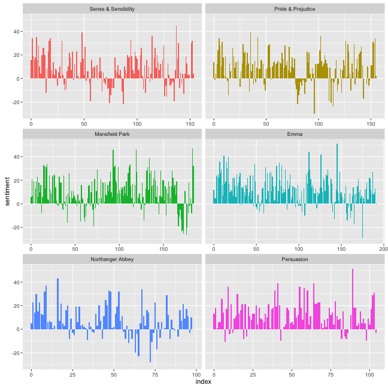
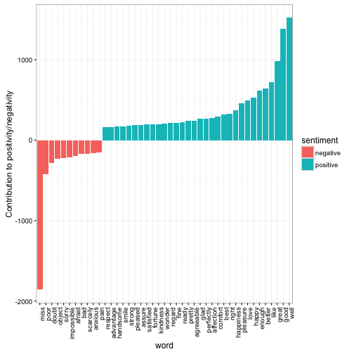

<!-- README.md is generated from README.Rmd. Please edit that file -->

tidytext: Text mining using dplyr, ggplot2, and other tidy tools
---------------

**Authors:** [David Robinson](http://varianceexplained.org/), [Julia Silge](http://juliasilge.com/)<br>
**License:** [MIT](https://opensource.org/licenses/MIT)<br>

[](https://cran.r-project.org/package=tidytext)
[](https://travis-ci.org/juliasilge/tidytext)


Using [tidy data principles](https://www.jstatsoft.org/article/view/v059i10) can make many text mining tasks easier, more effective, and  consistent with tools already in wide use. Much of the infrastructure needed for text mining with tidy data frames already exists in packages like `dplyr`, `broom`, and `ggplot2`; in this package, we go the rest of the way and provide tidying functions and supporting data sets to make analyzing text tidy.

### Installation

To install this package from Github, use `devtools`:


```r
library(devtools)
install_github("juliasilge/tidytext")
```

### Tidy text mining examples

The novels of Jane Austen can be so tidy! Let's use the text of Jane Austen's 6 completed, published novels from the `janeaustenr` package and our function to unnest and tokenize. We can use the `tokenizers` package if installed, or else stick with `str_split`. The default tokenizing is for words, but other options include characters, sentences, lines, paragraphs, and a regex pattern. By default, `unnest_tokens` drops the original text.


```r
library(tidytext)
library(janeaustenr)
library(dplyr)
originalbooks <- austen_books() %>%
  group_by(book) %>%
  mutate(linenumber = row_number()) %>%
  ungroup() %>%
  unnest_tokens(word, text)

originalbooks
#> Source: local data frame [724,971 x 3]
#> 
#>                   book linenumber        word
#>                 (fctr)      (int)       (chr)
#> 1  Sense & Sensibility          1       sense
#> 2  Sense & Sensibility          1         and
#> 3  Sense & Sensibility          1 sensibility
#> 4  Sense & Sensibility          3          by
#> 5  Sense & Sensibility          3        jane
#> 6  Sense & Sensibility          3      austen
#> 7  Sense & Sensibility          5        1811
#> 8  Sense & Sensibility         10     chapter
#> 9  Sense & Sensibility         10           1
#> 10 Sense & Sensibility         13         the
#> ..                 ...        ...         ...
```

We can remove stop words kept in a tidy data set in the `tidytext` package with an antijoin.


```r
data("stopwords")
books <- originalbooks %>%
  anti_join(stopwords)
#> Joining by: "word"
```

Now, let's see what are the most common words in all the books as a whole.


```r
books %>%
  count(word, sort = TRUE) 
#> Source: local data frame [13,896 x 2]
#> 
#>      word     n
#>     (chr) (int)
#> 1    miss  1854
#> 2    time  1337
#> 3   fanny   862
#> 4    dear   822
#> 5    lady   817
#> 6     sir   806
#> 7     day   797
#> 8    emma   787
#> 9  sister   727
#> 10  house   699
#> ..    ...   ...
```

Sentiment analysis can be done as an inner join. Three sentiment lexicons are in the `tidytext` package in the `sentiment` dataset. Let's examine how sentiment changes changes during each novel. Let's find a sentiment score for each word using the Bing lexicon, then count the number of positive and negative words in defined sections of each novel.


```r
library(tidyr)
bing <- sentiments %>%
  filter(lexicon == "bing") %>%
  select(-score)

janeaustensentiment <- originalbooks %>%
  inner_join(bing) %>% 
  count(book, index = linenumber %/% 80, sentiment) %>% 
  spread(sentiment, n, fill = 0) %>% 
  mutate(sentiment = positive - negative)
#> Joining by: "word"
```

Now we can plot these sentiment scores across the plot trajectory of each novel.


```r
library(ggplot2)

ggplot(janeaustensentiment, aes(index, sentiment, fill = book)) +
  geom_bar(stat = "identity", show.legend = FALSE) +
  facet_wrap(~book, ncol = 2, scales = "free_x")
```



For more examples of text mining using tidy data frames, see the tidytext vignette.

### Tidying document term matrices

Many existing text mining datasets are in the form of a DocumentTermMatrix class (from the `tm` package). For example, consider the corpus of 2246 Associated Press articles from the topicmodels dataset.


```r
data("AssociatedPress", package = "topicmodels")
AssociatedPress
#> <<DocumentTermMatrix (documents: 2246, terms: 10473)>>
#> Non-/sparse entries: 302031/23220327
#> Sparsity           : 99%
#> Maximal term length: 18
#> Weighting          : term frequency (tf)
```

If we want to analyze this with tidy tools, we need to transform it into a one-row-per-term data frame first. The `broom` package provides a `tidy` function to do this. (For more on the tidy verb, [see the `broom` package](https://github.com/dgrtwo/broom)).


```r
library(broom)
tidy(AssociatedPress)
#> Source: local data frame [302,031 x 3]
#> 
#>    document       term count
#>       (int)      (chr) (dbl)
#> 1         1     adding     1
#> 2         1      adult     2
#> 3         1        ago     1
#> 4         1    alcohol     1
#> 5         1  allegedly     1
#> 6         1      allen     1
#> 7         1 apparently     2
#> 8         1   appeared     1
#> 9         1   arrested     1
#> 10        1    assault     1
#> ..      ...        ...   ...
```

We could find the most negative documents:


```r
ap_sentiments %>%
  count(document, sentiment, wt = count) %>%
  ungroup() %>%
  spread(sentiment, n, fill = 0) %>%
  mutate(sentiment = positive - negative) %>%
  arrange(sentiment)
#> Source: local data frame [2,190 x 4]
#> 
#>    document negative positive sentiment
#>       (int)    (dbl)    (dbl)     (dbl)
#> 1      1251       54        6       -48
#> 2      1380       53        5       -48
#> 3       531       51        9       -42
#> 4        43       45       11       -34
#> 5      1263       44       10       -34
#> 6      2178       40        6       -34
#> 7       334       45       12       -33
#> 8      1664       38        5       -33
#> 9      2147       47       14       -33
#> 10      516       38        6       -32
#> ..      ...      ...      ...       ...
```

Or we can join the Austen and AP datasets and compare the frequencies of each word:


```r
comparison <- tidy(AssociatedPress) %>%
  count(word = term) %>%
  rename(AP = n) %>%
  inner_join(count(books, word)) %>%
  rename(Austen = n) %>%
  mutate(AP = AP / sum(AP),
         Austen = Austen / sum(Austen))
#> Joining by: "word"

comparison
#> Source: local data frame [4,430 x 3]
#> 
#>          word           AP       Austen
#>         (chr)        (dbl)        (dbl)
#> 1   abandoned 2.101799e-04 7.095218e-06
#> 2       abide 3.603084e-05 2.838087e-05
#> 3   abilities 3.603084e-05 2.057613e-04
#> 4     ability 2.942519e-04 2.128565e-05
#> 5      abroad 2.402056e-04 2.554278e-04
#> 6      abrupt 3.603084e-05 3.547609e-05
#> 7     absence 9.608225e-05 7.875692e-04
#> 8      absent 5.404626e-05 3.547609e-04
#> 9    absolute 6.605654e-05 1.844757e-04
#> 10 absolutely 2.101799e-04 6.740457e-04
#> ..        ...          ...          ...

library(scales)
ggplot(comparison, aes(AP, Austen)) +
  geom_point() +
  geom_text(aes(label = word), check_overlap = TRUE,
            vjust = 1, hjust = 1) +
  scale_x_log10(labels = percent_format()) +
  scale_y_log10(labels = percent_format()) +
  geom_abline(color = "red")
```



For more examples of working with document term matrices from other packages using tidy data principles, see the TODO vignette.

### Code of Conduct

This project is released with a [Contributor Code of Conduct](CONDUCT.md). By participating in this project you agree to abide by its terms.
