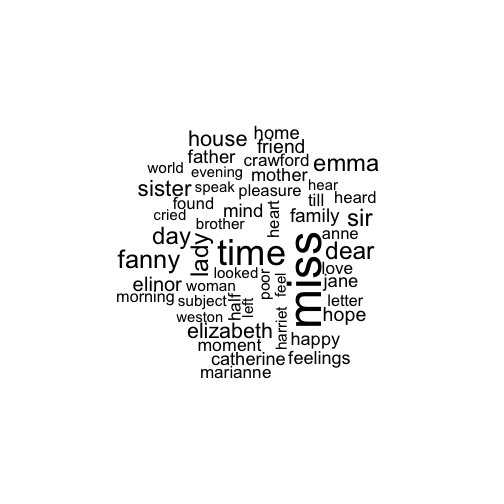
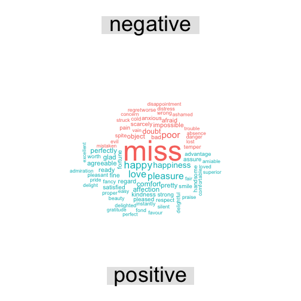

<!-- README.md is generated from README.Rmd. Please edit that file -->

tidytext: Text mining using dplyr, ggplot2, and other tidy tools
---------------

**Authors:** [David Robinson](http://varianceexplained.org/), [Julia Silge](http://juliasilge.com/)
**License:** [MIT](https://opensource.org/licenses/MIT)

[](https://cran.r-project.org/package=tidytext)
[](https://travis-ci.org/juliasilge/tidytext)


### Installation

To install this package from Github, use `devtools`:


```r
library(devtools)
install_github("juliasilge/tidytext")
#> Downloading GitHub repo juliasilge/tidytext@master
#> from URL https://api.github.com/repos/juliasilge/tidytext/zipball/master
#> Installing tidytext
#> Installing 1 package: tokenizers
#> 
#> The downloaded binary packages are in
#> 	/var/folders/qm/z0t23pj56qd_tfbjz4f66bj40000gp/T//RtmpbBwbsA/downloaded_packages
#> '/Library/Frameworks/R.framework/Resources/bin/R' --no-site-file  \
#>   --no-environ --no-save --no-restore --quiet CMD INSTALL  \
#>   '/private/var/folders/qm/z0t23pj56qd_tfbjz4f66bj40000gp/T/RtmpbBwbsA/devtools3dfe1c119791/juliasilge-tidytext-a0d053e'  \
#>   --library='/Library/Frameworks/R.framework/Versions/3.2/Resources/library'  \
#>   --install-tests
#> 
library(tidytext)
```

### Jane Austen's Novels Can Be So Tidy


```r
library(janeaustenr)
library(dplyr)
#> 
#> Attaching package: 'dplyr'
#> The following objects are masked from 'package:stats':
#> 
#>     filter, lag
#> The following objects are masked from 'package:base':
#> 
#>     intersect, setdiff, setequal, union
originalbooks <- bind_rows(
  data_frame(text = sensesensibility, book = "Sense & Sensibility"),
  data_frame(text = prideprejudice, book = "Pride & Prejudice"),
  data_frame(text = mansfieldpark, book = "Mansfield Park"),
  data_frame(text = emma, book = "Emma"),
  data_frame(text = northangerabbey, book = "Northanger Abbey"),
  data_frame(text = persuasion, book = "Persuasion")
) %>% mutate(book = factor(book, levels = unique(book)))
```

Where are the chapters?


```r
library(stringr)
originalbooks <- originalbooks %>%
  group_by(book) %>%
  mutate(linenumber = row_number(),
         chapter = cumsum(str_detect(text, regex("^chapter [\\divxlc]", 
                                                 ignore_case = TRUE)))) %>%
  ungroup()
```

Now we can use our new function for unnest and tokenizing. We can use the `tokenizers` package if installed, or else stick with `str_split`. The default tokenizing is for words, but other options include characters, sentences, lines, paragraphs, and a regex pattern. By default, `unnest_tokens` drops the original text.


```r
library(tidytext)
library(tokenizers)
#> Warning: package 'tokenizers' was built under R version 3.2.5
books <- originalbooks %>%
  unnest_tokens(word, text)

books
#> Source: local data frame [724,971 x 4]
#> 
#>                   book linenumber chapter        word
#>                 (fctr)      (int)   (int)       (chr)
#> 1  Sense & Sensibility          1       0       sense
#> 2  Sense & Sensibility          1       0         and
#> 3  Sense & Sensibility          1       0 sensibility
#> 4  Sense & Sensibility          2       0          by
#> 5  Sense & Sensibility          2       0        jane
#> 6  Sense & Sensibility          2       0      austen
#> 7  Sense & Sensibility          3       0        1811
#> 8  Sense & Sensibility          4       1     chapter
#> 9  Sense & Sensibility          4       1           1
#> 10 Sense & Sensibility          5       1         the
#> ..                 ...        ...     ...         ...
```

We can remove stop words kept in a tidy data set in the `tidytext` package.


```r
data("stopwords")

books <- books %>%
  anti_join(stopwords)
#> Joining by: "word"
```

Now, let's see what are the most common words in all the books as a whole.


```r
books %>%
  count(word, sort = TRUE) 
#> Source: local data frame [13,896 x 2]
#> 
#>      word     n
#>     (chr) (int)
#> 1    miss  1854
#> 2    time  1337
#> 3   fanny   862
#> 4    dear   822
#> 5    lady   817
#> 6     sir   806
#> 7     day   797
#> 8    emma   787
#> 9  sister   727
#> 10  house   699
#> ..    ...   ...
```

Sentiment analysis can be done as an inner join. Three sentiment lexicons are in the `tidytext` package in the `sentiment` dataset. Let's look at the words with a sadness score from the NRC lexicon. What are the most common sadness words in *Mansfield Park*?


```r
nrcsadness <- sentiments %>%
  filter(lexicon == "nrc", sentiment == "sadness")

books %>%
  filter(book == "Mansfield Park") %>% 
  semi_join(nrcsadness) %>%
  count(word, sort = TRUE)
#> Joining by: "word"
#> Source: local data frame [387 x 2]
#> 
#>          word     n
#>         (chr) (int)
#> 1      mother    89
#> 2     feeling    75
#> 3         ill    63
#> 4  impossible    57
#> 5       leave    56
#> 6         bad    49
#> 7        evil    48
#> 8       doubt    46
#> 9    scarcely    42
#> 10      worse    40
#> ..        ...   ...
```

Or instead we could examine how sentiment changes changes during each novel. Let's find a sentiment score for each word using the Bing lexicon, then count the number of positive and negative words in defined sections of each novel.


```r
library(tidyr)
bing <- sentiments %>%
  filter(lexicon == "bing") %>%
  select(-score)

janeaustensentiment <- books %>%
  inner_join(bing) %>% 
  count(book, index = linenumber %/% 80, sentiment) %>% 
  spread(sentiment, n, fill = 0) %>% 
  mutate(sentiment = positive - negative)
#> Joining by: "word"
```

Now we can plot these sentiment scores across the plot trajectory of each novel.


```r
library(ggplot2)

ggplot(janeaustensentiment, aes(index, sentiment, fill = book)) +
  geom_bar(stat = "identity", show.legend = FALSE) +
  facet_wrap(~book, ncol = 2, scales = "free_x")
```


### Most common positive and negative words

One advantage of having the table with both sentiment and word is that you can analyze word counts that contribute to each sentiment:


```r
bing_word_counts <- books %>%
  inner_join(bing) %>%
  count(word, sentiment, sort = TRUE) %>%
  ungroup() %>%
  select(-score)
#> Joining by: "word"
#> Error in eval(expr, envir, enclos): object 'score' not found

bing_word_counts
#> Error in eval(expr, envir, enclos): object 'bing_word_counts' not found
```

This can be shown in a graph:


```r
bing_word_counts %>%
  filter(n > 150) %>%
  mutate(n = ifelse(sentiment == "negative", -n, n)) %>%
  mutate(word = reorder(word, n)) %>%
  ggplot(aes(word, n, fill = sentiment)) +
  geom_bar(stat = "identity") +
  theme(axis.text.x = element_text(angle = 90, hjust = 1)) +
  ylab("Contribution to positivity/negativity")
#> Error in eval(expr, envir, enclos): object 'bing_word_counts' not found
```

This lets us spot an anomaly in the sentiment analysis- that the word "miss" is coded as negative.

### Wordclouds

We've seen that this works well with ggplot2. But having the words in a tidy format is useful for other plots as well.

For example, consider the wordcloud package.


```r
library(wordcloud)
#> Loading required package: RColorBrewer

books %>%
  count(word) %>%
  with(wordcloud(word, n, max.words = 50))
```



In other functions, such as `comparison.cloud`, you may need to turn it into a matrix with reshape2's acast:


```r
library(reshape2)

books %>%
  inner_join(bing) %>%
  count(word, sentiment, sort = TRUE) %>%
  acast(word ~ sentiment, value.var = "n", fill = 0) %>% 
  comparison.cloud(colors = c("#F8766D", "#00BFC4"),
                   max.words = 75)
#> Joining by: "word"
```



### Tidying document term matrices

Many existing text mining datasets are in the form of a DocumentTermMatrix class (from the tm package). For example, consider the corpus of 2246 Associated Press articles from the topicmodels dataset:


```r
data("AssociatedPress", package = "topicmodels")
#> Error in find.package(package, lib.loc, verbose = verbose): there is no package called 'topicmodels'
AssociatedPress
#> Error in eval(expr, envir, enclos): object 'AssociatedPress' not found
```

If we want to analyze this with tidy tools, we'd have to turn it into a one-row-per-term data frame first. topicmodels provides a `tidy` function to do this:


```r
tidy(AssociatedPress)
#> Error in eval(expr, envir, enclos): could not find function "tidy"
```

(For more on the tidy verb, [see the broom package](https://github.com/dgrtwo/broom)). You can then perform sentiment analysis on these newspaper articles:


```r
ap_sentiments <- tidy(AssociatedPress) %>%
  inner_join(bing, by = c(term = "word"))
#> Error in eval(expr, envir, enclos): could not find function "tidy"

ap_sentiments
#> Error in eval(expr, envir, enclos): object 'ap_sentiments' not found
```

We could find the most negative documents:


```r
ap_sentiments %>%
  count(document, sentiment, wt = count) %>%
  ungroup() %>%
  spread(sentiment, n, fill = 0) %>%
  mutate(sentiment = positive - negative) %>%
  arrange(sentiment)
#> Error in eval(expr, envir, enclos): object 'ap_sentiments' not found
```

Or see which words contributed to positivity/negativity:


```r
ap_sentiments %>%
  count(sentiment, term, wt = count) %>%
  ungroup() %>%
  filter(n >= 150) %>%
  mutate(n = ifelse(sentiment == "negative", -n, n)) %>%
  mutate(term = reorder(term, n)) %>%
  ggplot(aes(term, n, fill = sentiment)) +
  geom_bar(stat = "identity") +
  theme(axis.text.x = element_text(angle = 90, hjust = 1)) +
  ylab("Contribution to positivity/negativity")
#> Error in eval(expr, envir, enclos): object 'ap_sentiments' not found
```

We can finally join the Austen and AP datasets and compare the frequencies of each word:


```r
comparison <- tidy(AssociatedPress) %>%
  count(word = term) %>%
  rename(AP = n) %>%
  inner_join(count(books, word)) %>%
  rename(Austen = n) %>%
  mutate(AP = AP / sum(AP),
         Austen = Austen / sum(Austen))
#> Error in eval(expr, envir, enclos): could not find function "tidy"

comparison
#> Error in eval(expr, envir, enclos): object 'comparison' not found

ggplot(comparison, aes(AP, Austen)) +
  geom_point() +
  geom_text(aes(label = word), check_overlap = TRUE,
            vjust = 1, hjust = 1) +
  scale_x_log10(labels = percent_format()) +
  scale_y_log10(labels = percent_format()) +
  geom_abline(color = "red")
#> Error in ggplot(comparison, aes(AP, Austen)): object 'comparison' not found
```

### Code of Conduct

This project is released with a [Contributor Code of Conduct](CONDUCT.md). By participating in this project you agree to abide by its terms.
