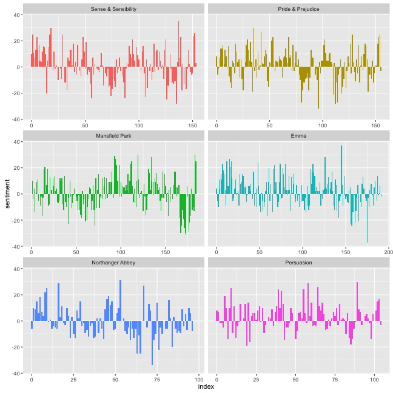
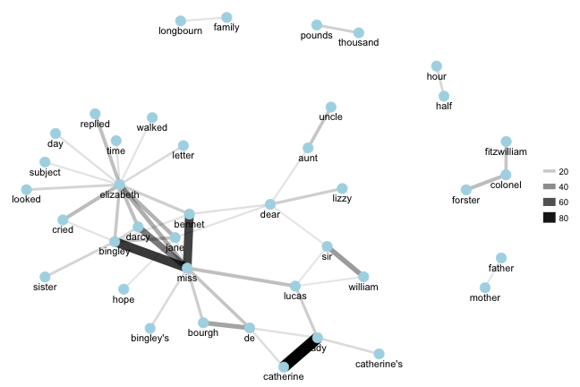
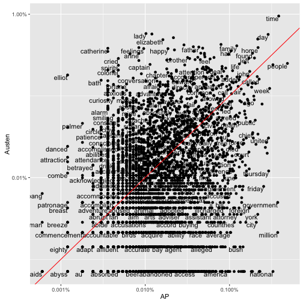

<!-- README.md is generated from README.Rmd. Please edit that file -->

tidytext: Text mining using dplyr, ggplot2, and other tidy tools
---------------

**Authors:** [Julia Silge](http://juliasilge.com/), [David Robinson](http://varianceexplained.org/)<br/>
**License:** [MIT](https://opensource.org/licenses/MIT)

[](https://travis-ci.org/juliasilge/tidytext)


Using [tidy data principles](https://www.jstatsoft.org/article/view/v059i10) can make many text mining tasks easier, more effective, and consistent with tools already in wide use. Much of the infrastructure needed for text mining with tidy data frames already exists in packages like [dplyr](https://cran.r-project.org/package=dplyr), [broom](https://cran.r-project.org/package=broom), [tidyr](https://cran.r-project.org/package=tidyr) and [ggplot2](https://cran.r-project.org/package=ggplot2). In this package, we provide functions and supporting data sets to allow conversion of text to and from tidy formats, and to switch seamlessly between tidy tools and existing text mining packages.

### Installation

To install this package from Github, use devtools:


```r
library(devtools)
install_github("juliasilge/tidytext")
```

### Tidy text mining example: the `unnest_tokens` function

The novels of Jane Austen can be so tidy! Let's use the text of Jane Austen's 6 completed, published novels from the [janeaustenr](https://cran.r-project.org/package=janeaustenr) package, and bring them into a tidy format. janeaustenr provides them as a one-row-per-line format:


```r
library(janeaustenr)
library(dplyr)

original_books <- austen_books() %>%
  group_by(book) %>%
  mutate(linenumber = row_number()) %>%
  ungroup()

original_books
#> Source: local data frame [70,942 x 3]
#> 
#>                     text                book linenumber
#>                    (chr)              (fctr)      (int)
#> 1  SENSE AND SENSIBILITY Sense & Sensibility          1
#> 2                        Sense & Sensibility          2
#> 3         by Jane Austen Sense & Sensibility          3
#> 4                        Sense & Sensibility          4
#> 5                 (1811) Sense & Sensibility          5
#> 6                        Sense & Sensibility          6
#> 7                        Sense & Sensibility          7
#> 8                        Sense & Sensibility          8
#> 9                        Sense & Sensibility          9
#> 10             CHAPTER 1 Sense & Sensibility         10
#> ..                   ...                 ...        ...
```

To work with this as a tidy dataset, we need to restructure it as **one-token-per-row** format. The `unnest_tokens` function is a way to convert a dataframe with a text column to be one-token-per-row:


```r
library(tidytext)
tidy_books <- original_books %>%
  unnest_tokens(word, text)

tidy_books
#> Source: local data frame [724,971 x 3]
#> 
#>                   book linenumber        word
#>                 (fctr)      (int)       (chr)
#> 1  Sense & Sensibility          1       sense
#> 2  Sense & Sensibility          1         and
#> 3  Sense & Sensibility          1 sensibility
#> 4  Sense & Sensibility          3          by
#> 5  Sense & Sensibility          3        jane
#> 6  Sense & Sensibility          3      austen
#> 7  Sense & Sensibility          5        1811
#> 8  Sense & Sensibility         10     chapter
#> 9  Sense & Sensibility         10           1
#> 10 Sense & Sensibility         13         the
#> ..                 ...        ...         ...
```

This function uses the [tokenizers package](https://github.com/lmullen/tokenizers) to separate each line into words. The default tokenizing is for words, but other options include characters, sentences, lines, paragraphs, or separation around a regex pattern.

Now that the data is in one-word-per-row format, we can manipulate it with tidy tools like dplyr. We can remove stop words (kept in the tidytext dataset `stop_words`) with an `anti_join`.


```r
data("stop_words")
tidy_books <- tidy_books %>%
  anti_join(stop_words)
```

We can also use `count` to find the most common words in all the books as a whole.


```r
tidy_books %>%
  count(word, sort = TRUE) 
#> Source: local data frame [13,896 x 2]
#> 
#>      word     n
#>     (chr) (int)
#> 1    miss  1854
#> 2    time  1337
#> 3   fanny   862
#> 4    dear   822
#> 5    lady   817
#> 6     sir   806
#> 7     day   797
#> 8    emma   787
#> 9  sister   727
#> 10  house   699
#> ..    ...   ...
```

Sentiment analysis can be done as an inner join. Three sentiment lexicons are in the tidytext package in the `sentiment` dataset. Let's examine how sentiment changes changes during each novel. Let's find a sentiment score for each word using the Bing lexicon, then count the number of positive and negative words in defined sections of each novel.


```r
library(tidyr)
bing <- sentiments %>%
  filter(lexicon == "bing") %>%
  select(-score)

bing
#> Source: local data frame [6,788 x 3]
#> 
#>           word sentiment lexicon
#>          (chr)     (chr)   (chr)
#> 1      2-faced  negative    bing
#> 2      2-faces  negative    bing
#> 3           a+  positive    bing
#> 4     abnormal  negative    bing
#> 5      abolish  negative    bing
#> 6   abominable  negative    bing
#> 7   abominably  negative    bing
#> 8    abominate  negative    bing
#> 9  abomination  negative    bing
#> 10       abort  negative    bing
#> ..         ...       ...     ...

janeaustensentiment <- tidy_books %>%
  inner_join(bing) %>% 
  count(book, index = linenumber %/% 80, sentiment) %>% 
  spread(sentiment, n, fill = 0) %>% 
  mutate(sentiment = positive - negative)

janeaustensentiment
#> Source: local data frame [891 x 5]
#> Groups: book, index [891]
#> 
#>                   book index negative positive sentiment
#>                 (fctr) (dbl)    (dbl)    (dbl)     (dbl)
#> 1  Sense & Sensibility     0       16       26        10
#> 2  Sense & Sensibility     1       19       44        25
#> 3  Sense & Sensibility     2       12       23        11
#> 4  Sense & Sensibility     3       15       22         7
#> 5  Sense & Sensibility     4       16       29        13
#> 6  Sense & Sensibility     5       16       39        23
#> 7  Sense & Sensibility     6       24       37        13
#> 8  Sense & Sensibility     7       22       39        17
#> 9  Sense & Sensibility     8       30       35         5
#> 10 Sense & Sensibility     9       14       18         4
#> ..                 ...   ...      ...      ...       ...
```

Now we can plot these sentiment scores across the plot trajectory of each novel.


```r
library(ggplot2)

ggplot(janeaustensentiment, aes(index, sentiment, fill = book)) +
  geom_bar(stat = "identity", show.legend = FALSE) +
  facet_wrap(~book, ncol = 2, scales = "free_x")
```



### Another example: the `pair_count` function

Another function is `pair_count`, which counts pairs of items that occur together within a group. Let's count the words that occur together in the lines of *Pride and Prejudice*.


```r
pride_prejudice_words <- tidy_books %>%
  filter(book == "Pride & Prejudice")
pride_prejudice_words
#> Source: local data frame [37,246 x 3]
#> 
#>                 book linenumber           word
#>               (fctr)      (int)          (chr)
#> 1  Pride & Prejudice      12441      pollution
#> 2  Pride & Prejudice      12430      liberties
#> 3  Pride & Prejudice      12425       sportive
#> 4  Pride & Prejudice      12419     heretofore
#> 5  Pride & Prejudice      12400       heedless
#> 6  Pride & Prejudice      12397       expences
#> 7  Pride & Prejudice      12381 congratulatory
#> 8  Pride & Prejudice      12376     revolution
#> 9  Pride & Prejudice      12372       moralize
#> 10 Pride & Prejudice      12348       relished
#> ..               ...        ...            ...

word_cooccurences <- pride_prejudice_words %>%
  pair_count(linenumber, word, sort = TRUE)

word_cooccurences
#> Source: local data frame [50,550 x 3]
#> 
#>       value1  value2     n
#>        (chr)   (chr) (dbl)
#> 1  catherine    lady    87
#> 2    bingley    miss    68
#> 3     bennet    miss    65
#> 4      darcy    miss    46
#> 5    william     sir    35
#> 6     bourgh      de    32
#> 7  elizabeth    miss    29
#> 8  elizabeth    jane    27
#> 9  elizabeth   cried    24
#> 10   forster colonel    24
#> ..       ...     ...   ...
```

This can be useful, for example, to plot a network of co-occuring words with the [igraph](http://igraph.org/) and [ggraph](https://github.com/thomasp85/ggraph) packages.


```r
library(igraph)
library(ggraph)

set.seed(2016)
word_cooccurences %>%
  filter(n >= 10) %>%
  graph_from_data_frame() %>%
  ggraph(layout = "fr") +
  geom_edge_link(aes(edge_alpha = n, edge_width = n)) +
  geom_node_point(color = "lightblue", size = 5) +
  geom_node_text(aes(label = name), vjust = 1.8) +
  theme_void()
```



For more examples of text mining using tidy data frames, see the tidytext vignette.

### Tidying document term matrices

Many existing text mining datasets are in the form of a DocumentTermMatrix class (from the tm package). For example, consider the corpus of 2246 Associated Press articles from the topicmodels dataset.


```r
library(tm)
data("AssociatedPress", package = "topicmodels")
AssociatedPress
#> <<DocumentTermMatrix (documents: 2246, terms: 10473)>>
#> Non-/sparse entries: 302031/23220327
#> Sparsity           : 99%
#> Maximal term length: 18
#> Weighting          : term frequency (tf)
```

If we want to analyze this with tidy tools, we need to transform it into a one-row-per-term data frame first with a `tidy` function. (For more on the tidy verb, [see the broom package](https://github.com/dgrtwo/broom)).


```r
tidy(AssociatedPress)
#> Source: local data frame [302,031 x 3]
#> 
#>    document       term count
#>       (int)      (chr) (dbl)
#> 1         1     adding     1
#> 2         1      adult     2
#> 3         1        ago     1
#> 4         1    alcohol     1
#> 5         1  allegedly     1
#> 6         1      allen     1
#> 7         1 apparently     2
#> 8         1   appeared     1
#> 9         1   arrested     1
#> 10        1    assault     1
#> ..      ...        ...   ...
```

We could find the most negative documents:


```r
ap_sentiments <- tidy(AssociatedPress) %>%
  inner_join(bing, by = c(term = "word")) %>%
  count(document, sentiment, wt = count) %>%
  ungroup() %>%
  spread(sentiment, n, fill = 0) %>%
  mutate(sentiment = positive - negative) %>%
  arrange(sentiment)
```

Or we can join the Austen and AP datasets and compare the frequencies of each word:


```r
comparison <- tidy(AssociatedPress) %>%
  count(word = term) %>%
  rename(AP = n) %>%
  inner_join(count(tidy_books, word)) %>%
  rename(Austen = n) %>%
  mutate(AP = AP / sum(AP),
         Austen = Austen / sum(Austen))

comparison
#> Source: local data frame [4,430 x 3]
#> 
#>          word           AP       Austen
#>         (chr)        (dbl)        (dbl)
#> 1   abandoned 2.101799e-04 7.095218e-06
#> 2       abide 3.603084e-05 2.838087e-05
#> 3   abilities 3.603084e-05 2.057613e-04
#> 4     ability 2.942519e-04 2.128565e-05
#> 5      abroad 2.402056e-04 2.554278e-04
#> 6      abrupt 3.603084e-05 3.547609e-05
#> 7     absence 9.608225e-05 7.875692e-04
#> 8      absent 5.404626e-05 3.547609e-04
#> 9    absolute 6.605654e-05 1.844757e-04
#> 10 absolutely 2.101799e-04 6.740457e-04
#> ..        ...          ...          ...

library(scales)
ggplot(comparison, aes(AP, Austen)) +
  geom_point() +
  geom_text(aes(label = word), check_overlap = TRUE,
            vjust = 1, hjust = 1) +
  scale_x_log10(labels = percent_format()) +
  scale_y_log10(labels = percent_format()) +
  geom_abline(color = "red")
```



For more examples of working with objects from other text mining packages using tidy data principles, see the vignette on converting to and from document term matrices.

### Code of Conduct

This project is released with a [Contributor Code of Conduct](CONDUCT.md). By participating in this project you agree to abide by its terms.
