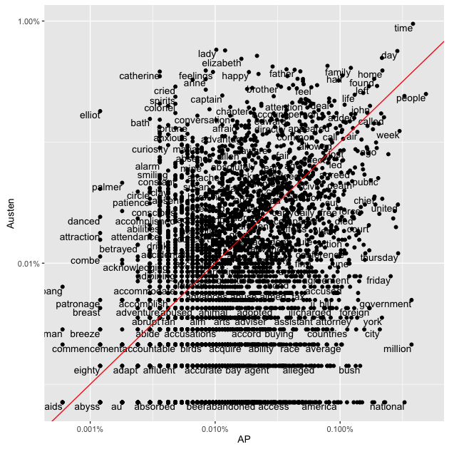
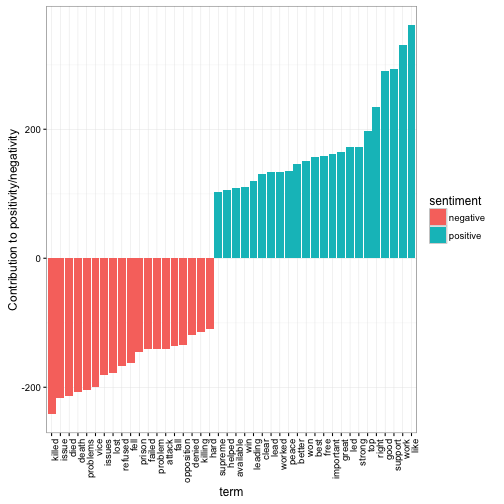
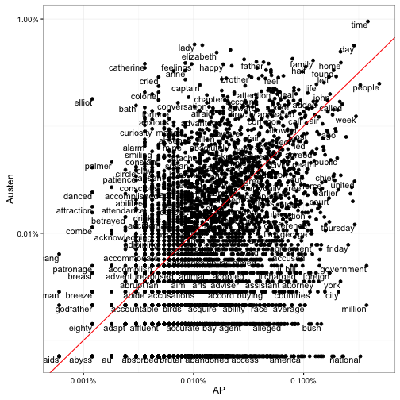

<!-- README.md is generated from README.Rmd. Please edit that file -->
[](https://travis-ci.org/juliasilge/tidytext)

tidytext: Text mining using dplyr, ggplot2, and other tidy tools
---------------


### Jane Austen's Novels Can Be So Tidy


```r
library(janeaustenr)
library(dplyr)
originalbooks <- bind_rows(
  data_frame(text = sensesensibility, book = "Sense & Sensibility"),
  data_frame(text = prideprejudice, book = "Pride & Prejudice"),
  data_frame(text = mansfieldpark, book = "Mansfield Park"),
  data_frame(text = emma, book = "Emma"),
  data_frame(text = northangerabbey, book = "Northanger Abbey"),
  data_frame(text = persuasion, book = "Persuasion")
) %>% mutate(book = factor(book, levels = unique(book)))
```

Where are the chapters?


```r
library(stringr)
originalbooks <- originalbooks %>%
  group_by(book) %>%
  mutate(linenumber = row_number(),
         chapter = cumsum(str_detect(text, regex("^chapter [\\divxlc]", 
                                                 ignore_case = TRUE)))) %>%
  ungroup()
```

Now we can use our new function for unnest and tokenizing. We can use the `tokenizers` package if installed, or else stick with `str_split`. The default tokenizing is for words, but other options include characters, sentences, lines, paragraphs, and a regex pattern. By default, `unnest_tokens` drops the original text.


```r
library(tidytext)
library(tokenizers)
#> Error in library(tokenizers): there is no package called 'tokenizers'
books <- originalbooks %>%
  unnest_tokens(word, text)
#> Tokenizer package not installed; using str_split instead.

books
#> Source: local data frame [725,008 x 4]
#> 
#>                   book linenumber chapter        word
#>                 (fctr)      (int)   (int)       (chr)
#> 1  Sense & Sensibility          1       0       sense
#> 2  Sense & Sensibility          1       0         and
#> 3  Sense & Sensibility          1       0 sensibility
#> 4  Sense & Sensibility          2       0          by
#> 5  Sense & Sensibility          2       0        jane
#> 6  Sense & Sensibility          2       0      austen
#> 7  Sense & Sensibility          4       1     chapter
#> 8  Sense & Sensibility          5       1         the
#> 9  Sense & Sensibility          5       1      family
#> 10 Sense & Sensibility          5       1          of
#> ..                 ...        ...     ...         ...
```

We can remove stop words kept in a tidy data set in the `tidytext` package.


```r
data("stopwords")

books <- books %>%
  anti_join(stopwords)
#> Joining by: "word"
```

Now, let's see what are the most common words in all the books as a whole.


```r
books %>%
  count(word, sort = TRUE) 
#> Source: local data frame [13,625 x 2]
#> 
#>      word     n
#>     (chr) (int)
#> 1    miss  1856
#> 2    time  1339
#> 3   fanny   859
#> 4    dear   820
#> 5    lady   817
#> 6     sir   805
#> 7     day   797
#> 8    emma   786
#> 9  sister   727
#> 10  house   699
#> ..    ...   ...
```

Sentiment analysis can be done as an inner join. Three sentiment lexicons are in the `tidytext` package in the `sentiment` dataset. Let's look at the words with a sadness score from the NRC lexicon. What are the most common sadness words in *Mansfield Park*?


```r
nrcsadness <- sentiments %>%
  filter(lexicon == "nrc", sentiment == "sadness")

books %>%
  filter(book == "Mansfield Park") %>% 
  semi_join(nrcsadness) %>%
  count(word, sort = TRUE)
#> Joining by: "word"
#> Source: local data frame [387 x 2]
#> 
#>          word     n
#>         (chr) (int)
#> 1      mother    89
#> 2     feeling    75
#> 3         ill    63
#> 4  impossible    57
#> 5       leave    56
#> 6         bad    49
#> 7        evil    48
#> 8       doubt    46
#> 9    scarcely    42
#> 10      worse    40
#> ..        ...   ...
```

Or instead we could examine how sentiment changes changes during each novel. Let's find a sentiment score for each word using the Bing lexicon, then count the number of positive and negative words in defined sections of each novel.


```r
library(tidyr)
bing <- sentiments %>%
  filter(lexicon == "bing") %>%
  select(-score)

janeaustensentiment <- books %>%
  inner_join(bing) %>% 
  count(book, index = linenumber %/% 80, sentiment) %>% 
  spread(sentiment, n, fill = 0) %>% 
  mutate(sentiment = positive - negative)
#> Joining by: "word"
```

Now we can plot these sentiment scores across the plot trajectory of each novel.


```r
library(ggplot2)

ggplot(janeaustensentiment, aes(index, sentiment, fill = book)) +
  geom_bar(stat = "identity", show.legend = FALSE) +
  facet_wrap(~book, ncol = 2, scales = "free_x")
```

 

### Most common positive and negative words

One advantage of having the table with both sentiment and word is that you can analyze word counts that contribute to each sentiment:


```r
bing_word_counts <- books %>%
  inner_join(bing) %>%
  count(word, sentiment, sort = TRUE) %>%
  ungroup() %>%
  select(-score)
#> Joining by: "word"
#> Error in eval(expr, envir, enclos): object 'score' not found

bing_word_counts
#> Source: local data frame [2,586 x 3]
#> 
#>          word sentiment     n
#>         (chr)     (chr) (int)
#> 1  abominable  negative    17
#> 2  abominably  negative     7
#> 3   abominate  negative     3
#> 4      abound  positive     1
#> 5      abrupt  negative     5
#> 6    abruptly  negative    12
#> 7     absence  negative   111
#> 8      absurd  negative    19
#> 9   absurdity  negative    12
#> 10  abundance  positive    14
#> ..        ...       ...   ...
```

This can be shown in a graph:


```r
bing_word_counts %>%
  filter(n > 150) %>%
  mutate(n = ifelse(sentiment == "negative", -n, n)) %>%
  mutate(word = reorder(word, n)) %>%
  ggplot(aes(word, n, fill = sentiment)) +
  geom_bar(stat = "identity") +
  theme(axis.text.x = element_text(angle = 90, hjust = 1)) +
  ylab("Contribution to positivity/negativity")
#> Warning: Stacking not well defined when ymin != 0
```

 

This lets us spot an anomaly in the sentiment analysis- that the word "miss" is coded as negative.

### Wordclouds

We've seen that this works well with ggplot2. But having the words in a tidy format is useful for other plots as well.

For example, consider the wordcloud package.


```r
library(wordcloud)

books %>%
  count(word) %>%
  with(wordcloud(word, n, max.words = 50))
```

 

In other functions, such as `comparison.cloud`, you may need to turn it into a matrix with reshape2's acast:


```r
library(reshape2)

books %>%
  inner_join(bing) %>%
  count(word, sentiment, sort = TRUE) %>%
  acast(word ~ sentiment, value.var = "n", fill = 0) %>% 
  comparison.cloud(colors = c("#F8766D", "#00BFC4"),
                   max.words = 75)
#> Joining by: "word"
```

 

### Tidying document term matrices

Many existing text mining datasets are in the form of a DocumentTermMatrix class (from the tm package). For example, consider the corpus of 2246 Associated Press articles from the topicmodels dataset:


```r
data("AssociatedPress", package = "topicmodels")
AssociatedPress
#> <<DocumentTermMatrix (documents: 2246, terms: 10473)>>
#> Non-/sparse entries: 302031/23220327
#> Sparsity           : 99%
#> Maximal term length: 18
#> Weighting          : term frequency (tf)
```

If we want to analyze this with tidy tools, we'd have to turn it into a one-row-per-term data frame first. topicmodels provides a `tidy` function to do this:


```r
tidy(AssociatedPress)
#> Source: local data frame [302,031 x 3]
#> 
#>    document       term count
#>       (int)      (chr) (dbl)
#> 1         1     adding     1
#> 2         1      adult     2
#> 3         1        ago     1
#> 4         1    alcohol     1
#> 5         1  allegedly     1
#> 6         1      allen     1
#> 7         1 apparently     2
#> 8         1   appeared     1
#> 9         1   arrested     1
#> 10        1    assault     1
#> ..      ...        ...   ...
```

(For more on the tidy verb, [see the broom package](https://github.com/dgrtwo/broom)). You can then perform sentiment analysis on these newspaper articles:


```r
ap_sentiments <- tidy(AssociatedPress) %>%
  inner_join(bing, by = c(term = "word"))

ap_sentiments
#> Source: local data frame [30,094 x 5]
#> 
#>    document    term count sentiment lexicon
#>       (int)   (chr) (dbl)     (chr)   (chr)
#> 1         1 assault     1  negative    bing
#> 2         1 complex     1  negative    bing
#> 3         1   death     1  negative    bing
#> 4         1    died     1  negative    bing
#> 5         1    good     2  positive    bing
#> 6         1 illness     1  negative    bing
#> 7         1  killed     2  negative    bing
#> 8         1    like     2  positive    bing
#> 9         1   liked     1  positive    bing
#> 10        1 miracle     1  positive    bing
#> ..      ...     ...   ...       ...     ...
```

We could find the most negative documents:


```r
ap_sentiments %>%
  count(document, sentiment, wt = count) %>%
  ungroup() %>%
  spread(sentiment, n, fill = 0) %>%
  mutate(sentiment = positive - negative) %>%
  arrange(sentiment)
#> Source: local data frame [2,190 x 4]
#> 
#>    document negative positive sentiment
#>       (int)    (dbl)    (dbl)     (dbl)
#> 1      1251       54        6       -48
#> 2      1380       53        5       -48
#> 3       531       51        9       -42
#> 4        43       45       11       -34
#> 5      1263       44       10       -34
#> 6      2178       40        6       -34
#> 7       334       45       12       -33
#> 8      1664       38        5       -33
#> 9      2147       47       14       -33
#> 10      516       38        6       -32
#> ..      ...      ...      ...       ...
```

Or see which words contributed to positivity/negativity:


```r
ap_sentiments %>%
  count(sentiment, term) %>%
  ungroup() %>%
  filter(n >= 100) %>%
  mutate(n = ifelse(sentiment == "negative", -n, n)) %>%
  mutate(term = reorder(term, n)) %>%
  ggplot(aes(term, n, fill = sentiment)) +
  geom_bar(stat = "identity") +
  theme(axis.text.x = element_text(angle = 90, hjust = 1)) +
  ylab("Contribution to positivity/negativity")
#> Warning: Stacking not well defined when ymin != 0
```

 

We can finally join the Austen and AP datasets and compare the frequencies of each word:


```r
comparison <- tidy(AssociatedPress) %>%
  count(word = term) %>%
  rename(AP = n) %>%
  inner_join(count(books, word)) %>%
  rename(Austen = n) %>%
  mutate(AP = AP / sum(AP),
         Austen = Austen / sum(Austen))
#> Joining by: "word"

comparison
#> Source: local data frame [4,431 x 3]
#> 
#>          word           AP       Austen
#>         (chr)        (dbl)        (dbl)
#> 1   abandoned 2.101635e-04 7.094916e-06
#> 2       abide 3.602803e-05 2.837966e-05
#> 3   abilities 3.602803e-05 2.057526e-04
#> 4     ability 2.942289e-04 2.128475e-05
#> 5      abroad 2.401869e-04 2.554170e-04
#> 6      abrupt 3.602803e-05 3.547458e-05
#> 7     absence 9.607475e-05 7.875357e-04
#> 8      absent 5.404204e-05 3.547458e-04
#> 9    absolute 6.605139e-05 1.844678e-04
#> 10 absolutely 2.101635e-04 6.740170e-04
#> ..        ...          ...          ...

ggplot(comparison, aes(AP, Austen)) +
  geom_point() +
  geom_text(aes(label = word), check_overlap = TRUE,
            vjust = 1, hjust = 1) +
  scale_x_log10(labels = percent_format()) +
  scale_y_log10(labels = percent_format()) +
  geom_abline(color = "red")
```

 
