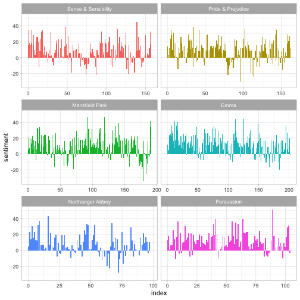
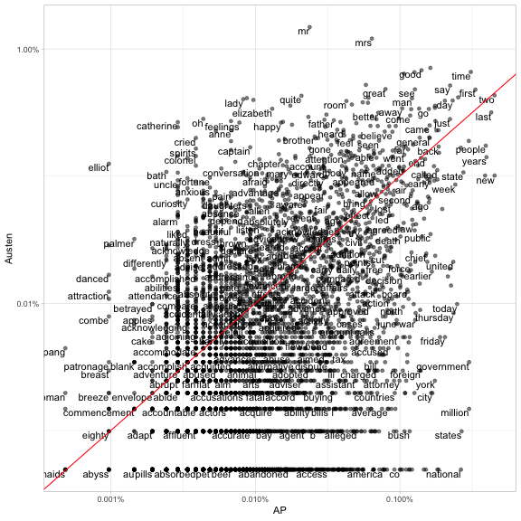

<!-- README.md is generated from README.Rmd. Please edit that file -->

tidytext: Text mining using dplyr, ggplot2, and other tidy tools
---------------

**Authors:** [Julia Silge](http://juliasilge.com/), [David Robinson](http://varianceexplained.org/)<br/>
**License:** [MIT](https://opensource.org/licenses/MIT)

[](https://travis-ci.org/juliasilge/tidytext)
[](https://ci.appveyor.com/project/juliasilge/tidytext)
[](https://cran.r-project.org/package=tidytext)
[](https://codecov.io/github/juliasilge/tidytext?branch=master)
[](https://zenodo.org/badge/latestdoi/22224/juliasilge/tidytext)
[](http://joss.theoj.org/papers/89fd1099620268fe0342ffdcdf66776f)
[](https://CRAN.R-project.org/package=tidytext)
[](https://CRAN.R-project.org/package=tidytext)


Using [tidy data principles](https://www.jstatsoft.org/article/view/v059i10) can make many text mining tasks easier, more effective, and consistent with tools already in wide use. Much of the infrastructure needed for text mining with tidy data frames already exists in packages like [dplyr](https://cran.r-project.org/package=dplyr), [broom](https://cran.r-project.org/package=broom), [tidyr](https://cran.r-project.org/package=tidyr) and [ggplot2](https://cran.r-project.org/package=ggplot2). In this package, we provide functions and supporting data sets to allow conversion of text to and from tidy formats, and to switch seamlessly between tidy tools and existing text mining packages. Check out [our book](https://www.tidytextmining.com/) to learn more about text mining using tidy data principles.

### Installation

You can install this package from CRAN:


```r
install.packages("tidytext")
```


Or you can install the development version from Github with [devtools](https://github.com/hadley/devtools):


```r
library(devtools)
install_github("juliasilge/tidytext")
```

### Tidy text mining example: the `unnest_tokens` function

The novels of Jane Austen can be so tidy! Let's use the text of Jane Austen's 6 completed, published novels from the [janeaustenr](https://cran.r-project.org/package=janeaustenr) package, and bring them into a tidy format. janeaustenr provides them as a one-row-per-line format:


```r
library(janeaustenr)
library(dplyr)

original_books <- austen_books() %>%
  group_by(book) %>%
  mutate(linenumber = row_number()) %>%
  ungroup()

original_books
#> # A tibble: 73,422 x 3
#>    text                  book                linenumber
#>    <chr>                 <fct>                    <int>
#>  1 SENSE AND SENSIBILITY Sense & Sensibility          1
#>  2 ""                    Sense & Sensibility          2
#>  3 by Jane Austen        Sense & Sensibility          3
#>  4 ""                    Sense & Sensibility          4
#>  5 (1811)                Sense & Sensibility          5
#>  6 ""                    Sense & Sensibility          6
#>  7 ""                    Sense & Sensibility          7
#>  8 ""                    Sense & Sensibility          8
#>  9 ""                    Sense & Sensibility          9
#> 10 CHAPTER 1             Sense & Sensibility         10
#> # ... with 73,412 more rows
```

To work with this as a tidy dataset, we need to restructure it as **one-token-per-row** format. The `unnest_tokens` function is a way to convert a dataframe with a text column to be one-token-per-row:


```r
library(tidytext)
tidy_books <- original_books %>%
  unnest_tokens(word, text)

tidy_books
#> # A tibble: 725,055 x 3
#>    book                linenumber word       
#>    <fct>                    <int> <chr>      
#>  1 Sense & Sensibility          1 sense      
#>  2 Sense & Sensibility          1 and        
#>  3 Sense & Sensibility          1 sensibility
#>  4 Sense & Sensibility          3 by         
#>  5 Sense & Sensibility          3 jane       
#>  6 Sense & Sensibility          3 austen     
#>  7 Sense & Sensibility          5 1811       
#>  8 Sense & Sensibility         10 chapter    
#>  9 Sense & Sensibility         10 1          
#> 10 Sense & Sensibility         13 the        
#> # ... with 725,045 more rows
```

This function uses the [tokenizers package](https://github.com/lmullen/tokenizers) to separate each line into words. The default tokenizing is for words, but other options include characters, n-grams, sentences, lines, paragraphs, or separation around a regex pattern.

Now that the data is in one-word-per-row format, we can manipulate it with tidy tools like dplyr. We can remove stop words (kept in the tidytext dataset `stop_words`) with an `anti_join`.


```r
data("stop_words")
tidy_books <- tidy_books %>%
  anti_join(stop_words)
```

We can also use `count` to find the most common words in all the books as a whole.


```r
tidy_books %>%
  count(word, sort = TRUE) 
#> # A tibble: 13,914 x 2
#>    word       n
#>    <chr>  <int>
#>  1 miss    1855
#>  2 time    1337
#>  3 fanny    862
#>  4 dear     822
#>  5 lady     817
#>  6 sir      806
#>  7 day      797
#>  8 emma     787
#>  9 sister   727
#> 10 house    699
#> # ... with 13,904 more rows
```

Sentiment analysis can be done as an inner join. Three sentiment lexicons are available via the `get_sentiments()` function. Let's examine how sentiment changes during each novel. Let's find a sentiment score for each word using the Bing lexicon, then count the number of positive and negative words in defined sections of each novel.


```r
library(tidyr)
get_sentiments("bing")
#> # A tibble: 6,788 x 2
#>    word        sentiment
#>    <chr>       <chr>    
#>  1 2-faced     negative 
#>  2 2-faces     negative 
#>  3 a+          positive 
#>  4 abnormal    negative 
#>  5 abolish     negative 
#>  6 abominable  negative 
#>  7 abominably  negative 
#>  8 abominate   negative 
#>  9 abomination negative 
#> 10 abort       negative 
#> # ... with 6,778 more rows

janeaustensentiment <- tidy_books %>%
  inner_join(get_sentiments("bing"), by = "word") %>% 
  count(book, index = linenumber %/% 80, sentiment) %>% 
  spread(sentiment, n, fill = 0) %>% 
  mutate(sentiment = positive - negative)

janeaustensentiment
#> # A tibble: 920 x 5
#>    book                index negative positive sentiment
#>    <fct>               <dbl>    <dbl>    <dbl>     <dbl>
#>  1 Sense & Sensibility  0        16.0     26.0     10.0 
#>  2 Sense & Sensibility  1.00     19.0     44.0     25.0 
#>  3 Sense & Sensibility  2.00     12.0     23.0     11.0 
#>  4 Sense & Sensibility  3.00     15.0     22.0      7.00
#>  5 Sense & Sensibility  4.00     16.0     29.0     13.0 
#>  6 Sense & Sensibility  5.00     16.0     39.0     23.0 
#>  7 Sense & Sensibility  6.00     24.0     37.0     13.0 
#>  8 Sense & Sensibility  7.00     22.0     39.0     17.0 
#>  9 Sense & Sensibility  8.00     30.0     35.0      5.00
#> 10 Sense & Sensibility  9.00     14.0     18.0      4.00
#> # ... with 910 more rows
```

Now we can plot these sentiment scores across the plot trajectory of each novel.


```r
library(ggplot2)

ggplot(janeaustensentiment, aes(index, sentiment, fill = book)) +
  geom_bar(stat = "identity", show.legend = FALSE) +
  facet_wrap(~book, ncol = 2, scales = "free_x")
```



For more examples of text mining using tidy data frames, see the tidytext vignette.

### Tidying document term matrices

Many existing text mining datasets are in the form of a DocumentTermMatrix class (from the tm package). For example, consider the corpus of 2246 Associated Press articles from the topicmodels dataset.


```r
library(tm)
data("AssociatedPress", package = "topicmodels")
AssociatedPress
#> <<DocumentTermMatrix (documents: 2246, terms: 10473)>>
#> Non-/sparse entries: 302031/23220327
#> Sparsity           : 99%
#> Maximal term length: 18
#> Weighting          : term frequency (tf)
```

If we want to analyze this with tidy tools, we need to transform it into a one-row-per-term data frame first with a `tidy` function. (For more on the tidy verb, [see the broom package](https://github.com/dgrtwo/broom)).


```r
tidy(AssociatedPress)
#> # A tibble: 302,031 x 3
#>    document term       count
#>       <int> <chr>      <dbl>
#>  1        1 adding      1.00
#>  2        1 adult       2.00
#>  3        1 ago         1.00
#>  4        1 alcohol     1.00
#>  5        1 allegedly   1.00
#>  6        1 allen       1.00
#>  7        1 apparently  2.00
#>  8        1 appeared    1.00
#>  9        1 arrested    1.00
#> 10        1 assault     1.00
#> # ... with 302,021 more rows
```

We could find the most negative documents:


```r
ap_sentiments <- tidy(AssociatedPress) %>%
  inner_join(get_sentiments("bing"), by = c(term = "word")) %>%
  count(document, sentiment, wt = count) %>%
  ungroup() %>%
  spread(sentiment, n, fill = 0) %>%
  mutate(sentiment = positive - negative) %>%
  arrange(sentiment)
```

Or we can join the Austen and AP datasets and compare the frequencies of each word:


```r
comparison <- tidy(AssociatedPress) %>%
  count(word = term) %>%
  rename(AP = n) %>%
  inner_join(count(tidy_books, word)) %>%
  rename(Austen = n) %>%
  mutate(AP = AP / sum(AP),
         Austen = Austen / sum(Austen))

comparison
#> # A tibble: 4,437 x 3
#>    word              AP     Austen
#>    <chr>          <dbl>      <dbl>
#>  1 abandoned  0.000210  0.00000709
#>  2 abide      0.0000360 0.0000284 
#>  3 abilities  0.0000360 0.000206  
#>  4 ability    0.000294  0.0000213 
#>  5 abroad     0.000240  0.000255  
#>  6 abrupt     0.0000360 0.0000355 
#>  7 absence    0.0000959 0.000787  
#>  8 absent     0.0000539 0.000355  
#>  9 absolute   0.0000659 0.000184  
#> 10 absolutely 0.000210  0.000674  
#> # ... with 4,427 more rows

library(scales)
ggplot(comparison, aes(AP, Austen)) +
  geom_point(alpha = 0.5) +
  geom_text(aes(label = word), check_overlap = TRUE,
            vjust = 1, hjust = 1) +
  scale_x_log10(labels = percent_format()) +
  scale_y_log10(labels = percent_format()) +
  geom_abline(color = "red")
```



For more examples of working with objects from other text mining packages using tidy data principles, see the vignette on converting to and from document term matrices.

### Community Guidelines

This project is released with a [Contributor Code of Conduct](CONDUCT.md). By participating in this project you agree to abide by its terms. Feedback, bug reports (and fixes!), and feature requests are welcome; file issues or seek support [here](http://github.com/juliasilge/tidytext/issues).
