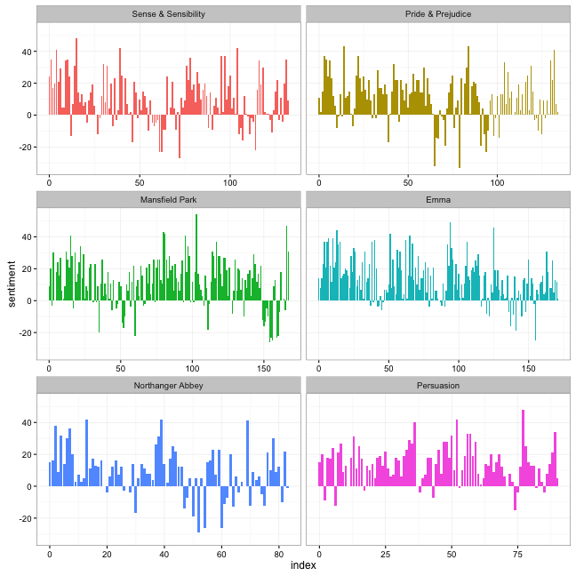

# Summary

The tidytext package is an R package[@R-base] for text mining using tidy data principles. As described by Hadley Wickham[@tidydata], tidy data has a specific structure:

* each variable is a column,
* each observation is a row, and
* each type of observational unit is a table.

Tidy data sets are easier to work with, and this is no less true when one starts to work with text. Most of the tooling and infrastructure needed for text mining with tidy data frames already exists in packages like dplyr[@R-dplyr], ggplot2[@R-ggplot2], broom[@R-broom], and others; in developing this package, we provide functions and supporting data sets to allow conversion of text to and from tidy formats, and to switch seamlessly between tidy tools and existing text mining packages.

We define the tidy text format as being one-token-per-document-per-row and provide functionality to tokenize by commonly used units of text including words, ngrams, and sentences. At the same time, the tidytext package doesn't expect a user to keep text data in a tidy form at all times during an analysis. The package includes functions to `tidy` objects (for more on the `tidy` verb, see the broom package[@R-broom]) from popular text mining R packages. This allows, for example, a workflow with easy reading, filtering, and processing to be done using dplyr and other tidy tools, after which the data can be converted into a document-term matrix for machine learning applications.

# References
